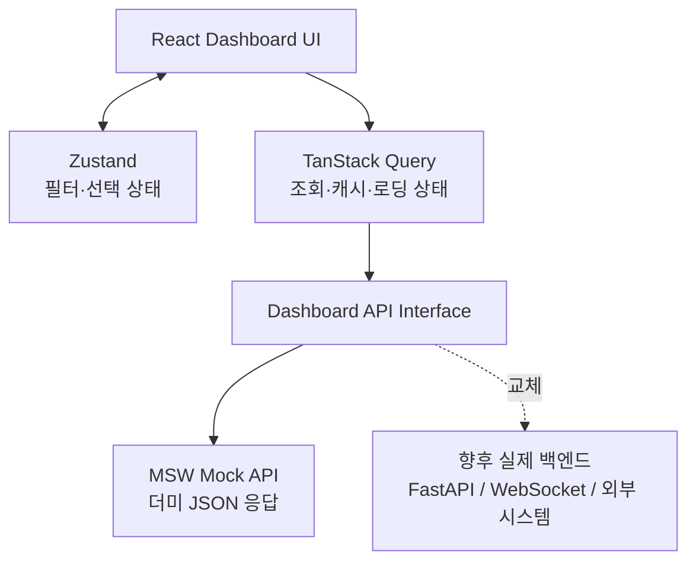

# 연구소 R&D 대시보드 웹 구현 설계

## 1. 목표와 구현 범위

연구소 디지털 트윈 아키텍처의 `6/6 연구소장 R&D 관제 대시보드` 이미지를 **레이아웃 기준 시안**으로 삼아, 더미 데이터 기반 웹 애플리케이션을 구현한다. 이 단계의 목표는 데이터 연동이나 AI 추론 자체가 아니라, 의사결정자가 이미지와 같이 R&D 현황을 한 화면에서 확인하는 사용자 경험을 검증하는 것이다.

중요: 일반적인 관리 화면처럼 좌측 메뉴와 여러 하위 페이지로 분산하지 않는다. 최초 화면은 이미지의 6/6 패널처럼 **10개 핵심 패널을 한 화면에 배치한 관제판**이어야 한다.

### 이번 단계에 구현할 것

- 기술동향, 요구사항, 설계/개발, 형상, 검증/시험, RAMS/SIL, 프로젝트, 현장 장애, 특허/IP, 차세대 R&D의 10개 핵심 패널
- 기간, 프로젝트, 시스템/제품 필터
- KPI 카드, 추세 차트, 상태 분포, 알림·리스크 목록
- 패널 클릭 시 상세 화면 또는 우측 상세 패널
- 로딩·빈 상태·오류 상태를 포함한 모의 API 데이터 흐름
- 반응형 레이아웃과 기본 접근성

### 이번 단계에서 제외할 것

- 실제 ERP, Jira, Git/PLM, 시험장비, 문서 저장소 연동
- LangGraph, LLM, RAG, Neo4j, 벡터 DB 구현
- 실제 로그인, 권한 관리, 승인 워크플로우
- 보고서 파일 생성 및 데이터 영속화

## 2. 권장 기술스택

| 구분 | 선택 | 이유 |
| --- | --- | --- |
| 앱 기반 | React + TypeScript + Vite | SSR이 필요 없는 대시보드 프로토타입을 빠르게 구현하고 정적 배포하기 좋다. Vite는 `react-ts` 템플릿을 제공한다. |
| 스타일 | Tailwind CSS + shadcn/ui | 카드·탭·표·다이얼로그 등 관리 화면 구성요소를 일관되게 구현한다. |
| 차트 | Recharts | 선/막대/도넛 차트를 React 컴포넌트로 구성한다. |
| 서버 상태 | TanStack Query | 지금은 모의 API, 이후 실제 REST API로 교체할 때도 조회·캐시·재요청 구조를 유지한다. |
| 화면 상태 | Zustand | 전역 필터, 선택된 패널, 사이드바 상태처럼 가벼운 클라이언트 상태를 관리한다. |
| API 모킹 | MSW | 브라우저 요청을 가로채 실제 API처럼 응답하므로, 백엔드 교체 비용을 낮춘다. |
| 테스트 | Vitest + React Testing Library | KPI 계산, 필터, 주요 화면 상호작용을 검증한다. |
| 품질 | ESLint + Prettier | 코드 형식과 기본 오류를 자동 점검한다. |
| 배포 | GitHub Pages 또는 Vercel | 정적 SPA 데모를 빠르게 공유한다. |

Vite의 React TypeScript 템플릿과 TanStack Query의 서버 상태 캐시 모델을 활용한다. 참고: [Vite Guide](https://vite.dev/guide/), [TanStack Query](https://tanstack.com/query/latest).

## 3. 전체 아키텍처



핵심 원칙은 UI가 더미 JSON 파일을 직접 읽지 않게 하는 것이다. 모든 데이터는 `api/`의 함수로만 조회하고, 개발 환경에서는 MSW가 이를 응답한다. 실제 FastAPI가 준비되면 MSW만 해제하고 API 함수의 URL·응답 매핑만 교체한다.

## 4. 이미지 기준 화면 레이아웃

### 데스크톱 기준 와이어프레임

이미지의 `6/6 연구소장 R&D 관제 대시보드`를 다음 구조로 재현한다. 기준 해상도는 1,440px 이상이며, 화면 폭을 최대한 활용하는 흰 배경의 관제판이다.

```text
┌─────────────────────────────────────────────────────────────────────────────────────────────┐
│ 연구소장 R&D 관제 대시보드 (10대 핵심 패널)                    [프로젝트] [기간] [시스템] │
│ R&D 전 과정을 한눈에 · 실시간 통합 모니터링                           마지막 갱신 09:30 │
├──────────────┬──────────────┬──────────────┬──────────────┬──────────────┤
│ 1 기술동향   │ 2 요구사항   │ 3 설계/개발  │ 4 형상 관리  │ 5 검증/시험  │
│ 추세 선차트  │ 도넛 + 목록  │ 진행률 막대  │ 버전 요약    │ PASS 도넛    │
├──────────────┼──────────────┼──────────────┼──────────────┼──────────────┤
│ 6 RAMS & SIL │ 7 프로젝트  │ 8 현장 장애  │ 9 특허 IP    │10 차세대 R&D │
│ Safety 도넛  │ 상태 요약   │ 월별 막대    │ 자산 요약    │ 로드맵 도넛  │
├──────────────┴──────────────┴──────────────┴──────────────┴──────────────┤
│ ▲ 고위험 이슈 3건  │  ◷ 시험 성적서 12건  │  ▣ 규격 개정 2건  │  ⬇ 보고서 다운로드 │
└─────────────────────────────────────────────────────────────────────────────────────────────┘
```

### 화면 규격과 시각 원칙

- 상단 타이틀 바: 청록색 계열(`#087A8A` 또는 유사색), 흰색 제목, 작은 부제목.
- 본문 여백: 16~24px. 패널 사이 간격: 12~16px.
- 10개 패널: 데스크톱에서 동일한 폭의 5열 × 2행. 각 패널은 테두리와 약한 그림자를 사용한다.
- 패널 헤더: 번호를 파란색으로 강조하고 제목은 한 줄로 유지한다.
- 수치: 패널의 상단 또는 중앙에 크게 표시하고, 보조 설명과 범례는 작게 배치한다.
- 차트: 카드 내부에서 높이를 통일한다. 선/막대/도넛은 이미지처럼 단순하고 정보 밀도 높은 형태로 사용한다.
- 상태색: 정상은 청록, 주의는 주황, 위험은 빨강, 정보는 파랑으로 통일한다. 색상 외에도 아이콘과 텍스트를 함께 표시한다.
- 하단 상태 바: 이미지처럼 주요 경고, 처리 대기, 규격 변경, 다운로드 동작을 수평으로 배치한다.
- 좌측 사이드바는 기본 화면에서 사용하지 않는다. 필요 시 작은 접이식 메뉴 또는 헤더의 메뉴 버튼으로만 제공한다.

### 반응형 전환

| 화면 폭 | 패널 배치 | 동작 |
| --- | --- | --- |
| 1,440px 이상 | 5열 × 2행 | 이미지 기준 관제판을 그대로 재현 |
| 1,024~1,439px | 3열 × 4행 | 패널 최소 폭을 보장 |
| 768~1,023px | 2열 × 5행 | 필터는 두 줄로 전환 |
| 767px 이하 | 1열 × 10행 | 하단 상태 바는 세로 목록으로 전환 |

### 10개 패널 정의

| 패널 | 주요 KPI | 시각화 | 더미 데이터 예시 |
| --- | --- | --- | --- |
| 기술동향 | 신규 규격, 논문, 특허 | 월별 추세선 | 규격 12건, 논문 32건, 특허 18건 |
| 요구사항 | 추적성, 승인/변경 수 | 도넛·리스트 | 추적성 78%, 변경 요청 6건 |
| 설계/개발 | HW/SW 진행률, 작업 수 | 가로 막대 | 설계 75%, SW 개발 68% |
| 형상 관리 | 버전, 커밋, 변경 요청 | 버전 카드 | v2.3.1, 커밋 1,245건 |
| 검증/시험 | PASS 비율, 실패 항목 | 도넛·표 | PASS 92%, FAIL 8% |
| RAMS/SIL | Safety Case, 위험도 | 도넛·리스크 목록 | 충족 85%, 고위험 2건 |
| 프로젝트 | 일정·예산·이슈 | 상태 카드 | 진행/지연/완료 건수 |
| 현장 장애 | 장애 건수, 심각도 | 막대 차트 | 월별 장애와 심각도 |
| 특허/IP | 출원, 등록, 심사 | 요약 카드 | 출원 25건, 등록 17건 |
| 차세대 R&D | 로드맵 진척도 | 도넛·타임라인 | 2027~2031, 63% |

## 5. 프런트엔드 폴더 구조

```text
src/
  app/
    App.tsx
    router.tsx
    providers.tsx
  pages/
    DashboardPage.tsx
    PanelDetailPage.tsx
  features/
    dashboard/
      components/
        DashboardHeader.tsx
        KpiSummary.tsx
        PanelGrid.tsx
        RiskAlerts.tsx
      api/dashboardApi.ts
      hooks/useDashboard.ts
      types.ts
    filters/
      FilterBar.tsx
      filterStore.ts
  components/
    ui/
    charts/
      TrendLineChart.tsx
      StatusDonutChart.tsx
      ProgressBarChart.tsx
  mocks/
    browser.ts
    handlers.ts
    data/dashboard.ts
  lib/
    format.ts
    constants.ts
  styles/
    globals.css
```

## 6. 데이터 계약 예시

```ts
export type DashboardFilters = {
  projectId: string;
  period: '30d' | '90d' | '1y';
  systemId: string | 'all';
};

export type MetricPanel = {
  id: string;
  title: string;
  subtitle: string;
  status: 'healthy' | 'warning' | 'critical' | 'neutral';
  primaryValue: string;
  change?: { value: number; direction: 'up' | 'down' };
  chart: { type: 'line' | 'bar' | 'donut'; data: Array<Record<string, unknown>> };
  actionLabel: string;
};

export type DashboardResponse = {
  updatedAt: string;
  summary: {
    overallHealth: number;
    openRisks: number;
    activeProjects: number;
    testPassRate: number;
  };
  panels: MetricPanel[];
  alerts: Array<{
    id: string;
    severity: 'high' | 'medium' | 'low';
    title: string;
    owner: string;
    createdAt: string;
  }>;
};
```

### 모의 API

| Method | Endpoint | 설명 |
| --- | --- | --- |
| `GET` | `/api/dashboard` | 필터 기준 전체 대시보드 데이터 |
| `GET` | `/api/panels/:panelId` | 패널 상세 데이터 |
| `GET` | `/api/projects` | 프로젝트 선택 목록 |
| `GET` | `/api/alerts` | 리스크·알림 목록 |

## 7. 구현 순서

1. Vite React TypeScript 프로젝트와 UI/차트/상태 라이브러리를 구성한다.
2. MSW와 `DashboardResponse` 더미 데이터를 만든다.
3. 이미지 기준의 상단 타이틀 바, 5열 × 2행 그리드, 하단 상태 바를 먼저 구현한다.
4. 10개 패널의 높이·제목·수치·차트 영역을 통일한다.
5. 각 카드에 선·막대·도넛 차트를 연결한다.
6. 필터 변경 시 TanStack Query의 query key가 바뀌도록 구현한다.
7. 카드 클릭 상세 패널, 리스크 알림, 지정된 반응형 전환을 구현한다.
8. 이미지 기준 해상도(1,440px), 태블릿, 모바일에서 레이아웃을 확인하고 테스트한다.

## 8. 개발 에이전트용 프롬프트

아래 프롬프트는 코드 생성 에이전트에 그대로 입력한다.

```text
React + TypeScript + Vite 기반의 "연구소 R&D 관제 대시보드"를 구현해줘.

목표
- 실제 백엔드 없이 MSW 더미 API로 동작하는 고품질 대시보드 프로토타입을 만든다.
- 이후 FastAPI 및 WebSocket 기반 실제 API로 쉽게 교체할 수 있도록 UI와 데이터 접근 계층을 분리한다.
- 한국어 UI로 구현한다.

필수 기술
- React, TypeScript, Vite
- Tailwind CSS와 shadcn/ui
- Recharts
- TanStack Query
- Zustand
- MSW
- Vitest와 React Testing Library

구현 요구사항
1. 첨부된 참조 이미지의 `6/6 연구소장 R&D 관제 대시보드` 형태를 최우선 시각 기준으로 사용한다.
2. 일반적인 좌측 사이드바 중심 관리 화면으로 만들지 말고, 상단 타이틀 바 + 10개 패널 관제판 + 하단 상태 바로 구성한다.
3. 상단은 청록색 제목 바다. 좌측에는 `연구소장 R&D 관제 대시보드 (10대 핵심 패널)`, 아래에는 `R&D 전 과정을 한눈에 - 실시간 통합 모니터링`을 표시한다. 우측에는 프로젝트·기간·시스템 필터와 마지막 갱신 시각을 배치한다.
4. 아래 10개 패널을 데스크톱에서 정확히 5열 x 2행의 동일 폭 그리드로 표시한다. 카드 사이 간격은 12~16px이고, 카드 내부의 차트 높이와 여백은 통일한다.
   - 기술동향, 요구사항 현황, 설계/개발 현황, 형상 관리, 검증/시험 현황
   - RAMS & SIL 현황, 프로젝트 현황, 현장 장애 분석, 특허 IP 현황, 차세대 R&D
5. 각 패널은 번호, 제목, 핵심 수치, 상태 배지, 변화량, 차트, 상세보기 동작을 가져야 한다.
6. 차트는 다음을 사용한다.
   - 기술동향: 월별 선 차트
   - 요구사항/검증시험/RAMS/차세대 R&D: 도넛 차트
   - 설계개발/현장장애: 막대 차트
7. 10개 패널 아래에는 `고위험 이슈`, `시험 성적서`, `규격 개정 알림`, `보고서 다운로드`를 담은 수평 하단 상태 바를 추가한다.
8. `src/features/dashboard/api/dashboardApi.ts`만 API 호출을 담당하게 한다.
9. MSW가 `/api/dashboard`, `/api/panels/:panelId`, `/api/projects`, `/api/alerts`를 모킹하게 한다.
10. 필터 값은 Zustand로 관리하고, TanStack Query query key에 포함해 필터 변경 때 데이터가 다시 조회되게 한다.
11. 로딩 스켈레톤, 오류 재시도, 빈 상태, 툴팁, 키보드 접근성, 색상만으로 상태를 구분하지 않는 UI를 포함한다.
12. 더미 데이터는 현실적인 철도 R&D 맥락으로 만든다. 예: 규격 12건, 요구사항 추적성 78%, 시험 PASS 92%, Safety Case 85%, 차세대 R&D 63%.
13. 디자인은 이미지와 같이 흰색 바탕, 네이비/청록 중심, 얇은 테두리, 작은 아이콘, 높은 정보 밀도의 엔터프라이즈 관제 화면으로 한다. 그라데이션·대형 히어로 영역·과한 둥근 모서리는 사용하지 않는다.
14. 1,440px 화면에서는 스크롤 없이 상단 바, 10개 패널, 하단 상태 바가 한 화면에 최대한 보이도록 패널 높이와 폰트 크기를 조정한다.
15. README에 실행 방법, 주요 폴더 구조, 실제 API로 교체할 위치를 작성한다.
16. 핵심 필터 변경과 패널 렌더링에 대한 테스트를 작성한다.

완료 기준
- `npm run dev`로 실행된다.
- 모든 데이터는 MSW 모의 API를 거쳐 표시된다.
- TypeScript 오류와 lint 오류가 없다.
- 데스크톱, 태블릿, 모바일 레이아웃을 확인한다.
```

## 9. 실제 아키텍처로 확장할 때의 연결점

프로토타입이 승인되면 아래 순서로 확장한다.

1. MSW 핸들러를 FastAPI REST 엔드포인트로 교체한다.
2. 실시간 진행률·알림만 WebSocket 또는 SSE로 추가한다.
3. 프로젝트·요구사항·형상·시험 데이터를 Jira, Git/PLM, 시험 시스템에서 수집한다.
4. AI 분석 결과는 별도 `insights` API로 노출하고, 대시보드는 결과와 근거 링크만 표시한다.
5. 로그인/역할/승인 이력은 API Gateway 및 인증 계층에서 처리한다.

이 순서는 더미 UI 검증과 실제 데이터·AI 플랫폼 구축을 분리해, 초기 구현 속도와 이후 확장성을 함께 확보한다.
